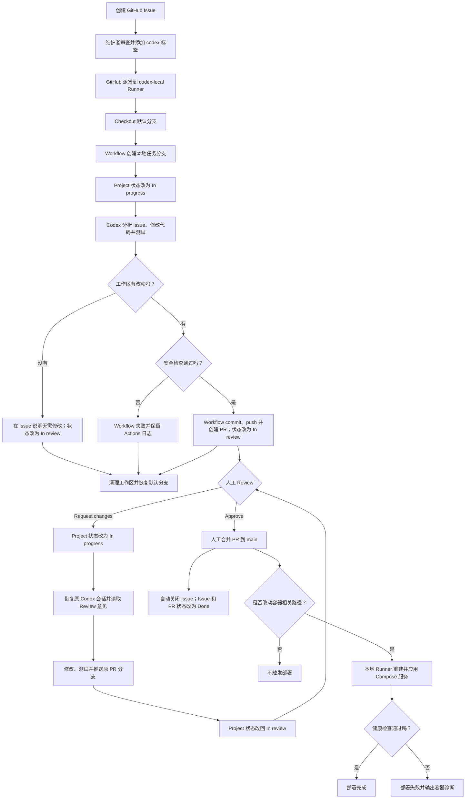
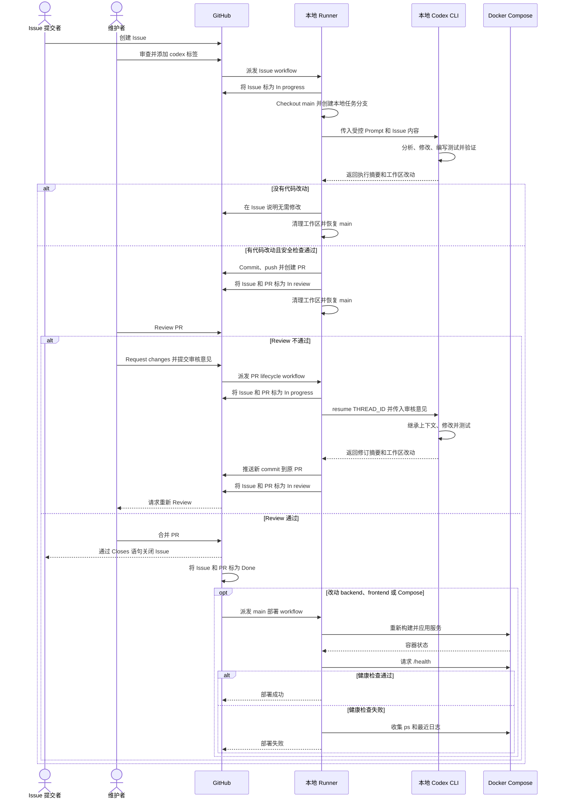

# GitHub Issue 驱动本地 Codex

本仓库使用 GitHub self-hosted runner，仅把 GitHub 账号 `judgelight` 创建且带有 `codex` 标签的 Issue 交给本机已登录的 Codex CLI。工作流先创建本地任务分支，再让 Codex 修改并验证代码；有改动时才推送分支和创建 Pull Request。它不会直接更新默认分支。

公开仓库的其他用户仍可提交 Issue，但即使被添加 `codex` 标签，也会在 Job 条件处跳过，不派发本地 Codex 任务。检查 Job 还会通过 API 再次确认作者、Issue 状态和标签。首次测试需要先将 workflow 推送到默认分支，再由 `judgelight` 创建 Issue 并添加 `codex` 标签；工作流上线前已添加的标签需移除后重新添加。

## 为什么使用 Codex CLI

每个自动化 Job 都使用一次非交互式 Codex turn；初次实现使用 `codex exec`，Review 返工使用 `codex exec resume` 继续原会话：

- Codex CLI：适合当前的单任务 CI 自动化，依赖少，也能复用本机 Codex 登录。
- Codex SDK：适合后续需要自建队列、重试、并发、结构化事件或多轮任务状态时使用。
- Codex App Server：适合开发长期运行、支持流式交互和审批界面的 Codex 产品，不适合这个最小工作流。

OpenAI 也提供 [`openai/codex-action`](https://learn.chatgpt.com/docs/github-action)，它同样会在底层运行 `codex exec`，更适合 GitHub-hosted runner 和以 GitHub Secret 管理 API key 的方案。本仓库直接调用 CLI，是为了明确复用本机安装、登录状态和隔离策略。

## 工作流程

1. 用户创建描述清楚的 GitHub Issue。
2. 有标签权限的维护者审查内容，并添加 `codex` 标签。
3. GitHub 将任务派发给带有 `codex-local` 标签的 Linux self-hosted runner。
4. 工作流从默认分支创建一个仅存在于 runner 工作区的 `codex/issue-...` 任务分支。
5. runner 执行 `scripts/run-codex-issue.sh`，由本地 `codex exec` 判断是否需要修改；需要时修改代码并运行测试。
6. 脚本持久保存 Codex 会话，并把 thread ID 写入 PR 的隐藏元数据，供返工时准确恢复。
7. 工作流拒绝发布对 `.github/workflows`、`.github/actions`、`.gitmodules` 或 Codex 执行脚本本身的改动，也拒绝 Codex 自行创建提交。
8. 有代码改动时提交并推送任务分支，然后创建 PR；没有改动时不推送分支，只在 Issue 留下 Codex 的说明。
9. Job 结束时丢弃 runner 工作区中的临时内容，恢复到远程默认分支并删除本地任务分支；已经推送的远程 PR 分支不受影响。

## 分支与 Review 生命周期

### Codex 判断不需要修改

不创建 commit、不推送远程分支，也不创建 PR。工作流把 Codex 的原因写入 Issue，随后清理 runner 工作区并恢复到默认分支。

### Codex 产生改动

工作流统一执行 `git add`、创建 Conventional Commit、推送任务分支并创建 PR。Codex 本身接触不到发布令牌，也不负责 Git 发布操作。PR 正文包含隐藏的 `codex-thread-id`，它只用于让同一台 runner 恢复初次 Codex 会话。

### Review 通过

当前设计刻意不自动合并。审核者在 GitHub 上确认测试和改动后手动合并 PR；PR 正文中的 `Closes #<编号>` 会在合并后自动关闭对应 Issue。建议在仓库设置中启用合并后自动删除 head branch。若合并内容涉及后端、前端或 Compose 文件，`main` 的 push 事件随后会触发本地 Docker 部署工作流。

### Review 不通过

受信任审核者使用 `Request changes` 并写明问题后，`.github/workflows/codex-pr-lifecycle.yml` 会读取总评和行内评论、checkout 原 PR 分支，并通过 `codex exec resume <THREAD_ID>` 恢复初次会话。Codex 在同一上下文中修改和测试，工作流再把新 commit 推送到原 PR，随后等待重新 Review。

只有 `OWNER`、`MEMBER` 或 `COLLABORATOR` 提交的 `Request changes` 才能触发，而且只处理本仓库中以 `codex/issue-` 开头的分支。每次明确的 Review 最多触发一次修订；同一个 PR 的运行会串行排队，避免并发写同一分支。如果持久会话在 runner 本机被删除或任务被派给没有该会话的另一台 runner，修订会明确失败，不会静默开启一个失去上下文的新会话。

Runner 不会等待 PR 合并或 Issue 关闭才恢复：每次 Job 结束时都会立即回到干净的默认分支。这个清理只发生在 Actions 自己的 `_work` checkout 中，不会操作开发者日常使用的另一个本地仓库目录。

## GitHub Project 状态同步

PR Review 事件是 Agent 行为的触发源，Project Status 是同步后的流程看板，不作为执行命令。这样可以确保每次返工都对应一条可审计的 `Request changes`，避免仅仅拖动看板卡片就让本机执行代码。

当前五种状态按以下方式使用：

| 状态 | 用途 |
| --- | --- |
| `Backlog` | 尚未排期，由维护者管理 |
| `Ready` | 已具备执行条件，但尚未添加 `codex` 标签 |
| `In progress` | Codex 正在初次实现或处理 Review 返工 |
| `In review` | 已创建/更新 PR，或 Codex 判断无需改动，等待人工确认 |
| `Done` | Codex PR 已合并，Issue 和 PR 均完成 |

状态同步失败不会阻断代码修改、PR 或 Review 主流程，但会在 Actions 日志中留下失败步骤。没有配置 Project 时，脚本会直接跳过同步。

在仓库 `Settings → Secrets and variables → Actions` 中配置：

- Variable `PROJECT_NUMBER`：Project URL 末尾的数字，例如 `/projects/7` 填 `7`。
- Variable `PROJECT_OWNER`：Project 所有者的登录名；不填时默认使用仓库所有者 `riku-studio`。
- Secret `PROJECT_TOKEN`：具有该 GitHub Project 写权限的 PAT。`gh project` 至少需要 `project` 权限；组织启用 SSO 时还需要授权该 token。

同步脚本会把对应 Issue 和 PR 自动加入 Project，再更新 `Status` 单选字段。状态名匹配不区分大小写，但字段名必须为 `Status`。

## 流程图



## 时序图



## 合并后应用到本地 Docker

`.github/workflows/deploy-main-to-local-docker.yml` 独立处理部署。它只在以下情况运行：

- `main` 中的 `backend/**`、`frontend/**` 或 `infra/docker-compose.yml` 发生变化；
- 维护者在 Actions 页面手动执行 `workflow_dispatch`。

部署工作流使用固定的 Compose project 名 `infra`，在本机 `/home/judgelight/share/projects/EREX/infra` 内校验配置并执行 `docker compose up -d --build --remove-orphans`。随后检查 `/health` 和前端首页，每次请求连接超时 3 秒、总超时 10 秒，最多尝试 12 次。失败时输出容器状态和最近 200 行日志；当前不自动回滚。

无需配置 `EREX_ENV_FILE`。Compose 直接读取当前项目的 `.env` 和 `/srv/secrets/litellm.env`；`.env` 和 `data/` 由 Git 忽略，不上传 GitHub。Runner 服务用户必须能读取环境文件、操作 Docker daemon，并且本机必须已存在 `shared_network` 和 `ollama_default` 两个外部网络。

工作流仅允许从 `main` 部署，固定事件 SHA，并在运行摘要记录版本。先从 Actions checkout 获取该提交，再对本机项目执行快进更新。若本机不是 main、有未提交改动、已有领先提交或分支分叉，则停止并保留现场，不 reset 或 clean 本机项目。迁移机器时需修改 workflow 中的本机路径。

部署目录的调整不会自动增加数据持久化。本次不修改现有容器挂载，不执行备份或迁移；容器内未挂载的数据仍会在容器被重建时丢失。

> 如果当前运行的 Compose project 名不是 `infra`，必须在部署前把 workflow 中的 `COMPOSE_PROJECT_NAME` 调整为实际名称，否则可能创建第二套容器而不是更新现有容器。可用 `docker compose -f infra/docker-compose.yml ls` 或容器的 `com.docker.compose.project` 标签确认。

## 一次性配置

### 1. 准备专用执行账号

建议为 runner 使用专用的低权限操作系统账号。该账号必须能访问构建所需工具，但不应能读取个人 SSH 密钥、云凭据或无关目录。

在该账号下确认依赖：

```bash
codex --version
codex login status
git --version
gh --version
jq --version
uv --version
```

如果尚未登录 Codex，在该账号下执行 `codex login`。也可以使用单独的 API key 登录，但不要把 key 写进仓库或工作流文件。

### 2. 注册 self-hosted runner

进入仓库的 `Settings → Actions → Runners → New self-hosted runner`，按 GitHub 页面生成的命令安装和注册 runner。注册时增加自定义标签 `codex-local`，并将 runner 安装为后台服务。

工作流要求以下标签同时匹配：

```text
self-hosted, linux, codex-local
```

runner 服务必须由上一步登录 Codex 的同一操作系统账号运行，否则它无法访问该账号的 Codex 登录状态。

Codex 会话保存在该 runner 用户的 Codex home 中。为保证 `Request changes` 能恢复初次会话，不要给第二台机器添加相同的 `codex-local` 标签，除非两台机器共享并安全管理同一份 Codex 会话存储。

### 3. 创建触发标签

在 GitHub 仓库中创建名为 `codex` 的 Issue 标签。不要通过 Issue 模板自动给所有新 Issue 添加这个标签；它是维护者确认并批准本地执行的安全闸门。

### 4. 设置仓库保护

建议启用默认分支保护，要求 PR 审查和测试通过后才能合并。工作流只在 Codex 运行完毕后把短期 `GITHUB_TOKEN` 提供给发布步骤。执行脚本还会通过一个最小环境启动 Codex，仅保留登录和基础运行所需变量，避免把 GitHub Actions 的运行时变量传给模型可调用的进程。

## 使用方式

Issue 中至少写清楚：

- 当前行为与期望行为；
- 可复现步骤或输入样例；
- 验收条件；
- 明确不应修改的范围。

维护者确认 Issue 适合自动执行后添加 `codex` 标签。可在仓库的 Actions 页面查看实时日志，完成后检查自动创建的 PR。

如果任务失败，先移除再重新添加 `codex` 标签即可创建一次新的运行。若该 Issue 已有开放的 Codex PR，工作流会留言并跳过，避免重复创建；请在原 PR 上继续 Review。每次新的实现使用不同分支名，不会覆盖上一次结果。

实现和返工失败或取消时会尽力留言附上运行链接，并将看板恢复到 `In review` 等待人工处理；runner 强制离线时收尾步骤可能无法执行。返工没有产生改动时也恢复 `In review`。Review 使用 `queue: max` 保留最多 100 个等待任务，执行前重新查询 PR 是否仍打开、Review 是否仍为 Request changes；推送前再次检查 PR 状态。

## 安全边界

- self-hosted runner 会在本机执行由 Issue 间接触发的代码，建议使用专用账号、专用工作目录，最好再置于虚拟机或容器中。
- 只有维护者审查并添加 `codex` 标签后才运行；不要让不可信机器人自动加此标签。
- Codex 使用 `workspace-write` sandbox 和自动审批审查，不使用 `danger-full-access` 或跳过 sandbox。
- Codex 进程使用经过清理的最小环境；GitHub 发布令牌仅在后续发布步骤中出现。
- Codex 被禁止修改自动化配置和执行脚本；脚本在发布前还会再次检查这些路径和当前提交。
- Review Job 从默认分支提取并执行受信任的自动化脚本，不会把 Project token 交给 PR 分支中的脚本。
- PR 中的 thread ID 不是登录凭据，但对应会话内容持久保存在 runner 用户目录中，应为该目录配置合理的权限与保留周期。
- 自动 PR 仍需人工审查。不要为机器人开启绕过分支保护的权限。
- 若机器还存有生产凭据，即使 prompt 有禁止读取秘密的说明，也不应把提示词当成安全隔离；应通过操作系统账号、目录权限或容器真正隔离。

## 相关文件

- `.github/workflows/issue-to-local-codex.yml`：GitHub 事件、runner 和 PR 发布逻辑。
- `.github/workflows/codex-pr-lifecycle.yml`：处理 `Request changes`、恢复 Codex 会话及合并后的 Done 状态。
- `.github/workflows/deploy-main-to-local-docker.yml`：合并到 `main` 后重建并验证本地容器。
- `scripts/run-codex-issue.sh`：安全构造初次 prompt、启动持久会话并检查受保护路径。
- `scripts/revise-codex-pr.sh`：恢复原会话、处理 Review 意见并检查修订结果。
- `scripts/sync-project-status.sh`：把 Issue/PR 加入 Project 并同步五档 Status。
